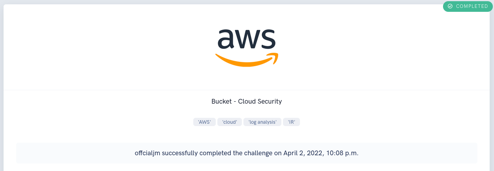

<h1 align="center"> Bucket CTF Walkthrough </h1>

<h3 align="center">

</h3>

Welcome, Defender! As an incident responder, we're granting you access to the AWS account called "Security" as an IAM user. This account contains a copy of the logs during the time period of the incident and has the ability to assume the "Security" role in the target account so you can look around to spot the misconfigurations that allowed for this attack to happen.

The following skills that are gained/utilized in this challenge are: `AWS` `Cloud` `Log Analysis` `Incident Response`

  

<h1> First Impressions </h1>

