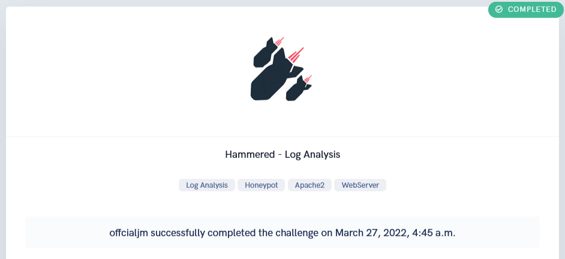
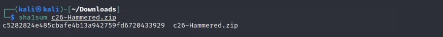
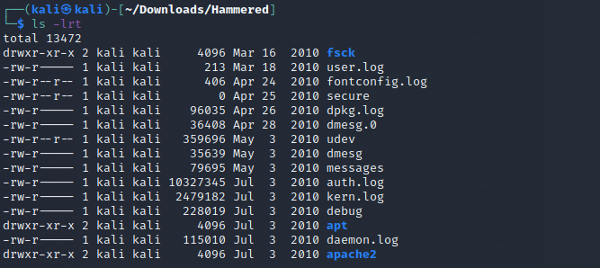

<h1 align="center"> Hammered CTF Walkthrough </h1>

<h3 align="center">

</h3>

This challenge takes you into the world of virtual systems and confusing log data. In this challenge, figure out what happened to this webserver honeypot using the logs from a possibly compromised server.

The following skills that are gained/utilized in this challenge are: `Log Analysis` `WebServer` `Honeypot` `Apache2`

  

<h1> First Impressions </h1>

Before we take any further actions on the challenges or do any investigations, we need to realize the initial scope of the CTF. Looking at the challenge instructions, we are given a zip file and a list of files to focus our analysis on:

    File Name: c26-Hammered.zip
    File Size: 944 KB
    SHA1SUM: c5282824e485cbafe4b13a942759fd6720433929

Make sure you verify the **SHA1SUM** hash value of any files you download by doing the following:

Below are all files that are present after extracting the zip archive:

**Files in Scope**:
- kern.log
- auth.log
- daemon.log
- dmesg
- apache2

  

<h1> Challenge Questions </h1>

### Q1. Which service did the attackers use to gain access to the system?

  

### Q2. What is the operating system version of the targeted system?
  

### Q3. What is the name of the compromised account?
  

### Q4. Consider that each unique IP represents a different attacker. How many attackers were able to get access to the system?
  

### Q5. Which attacker's IP address successfully logged into the system the most number of times?
  

### Q6. How many requests were sent to the Apache Server?
  

### Q7. How many rules have been added to the firewall?
  

### Q8. One of the downloaded files to the target system is a scanning tool. Provide the tool name.
  

### Q9. When was the last login from the attacker with IP 219.150.161.20? Format: MM/DD/YYYY HH:MM:SS AM
  

### Q10. The database displayed two warning messages, provide the most important and dangerous one.
  

### Q11. Multiple accounts were created on the target system. Which one was created on Apr 26 04:43:15?
  

### Q12. Few attackers were using a proxy to run their scans. What is the corresponding user-agent used by this proxy?
  