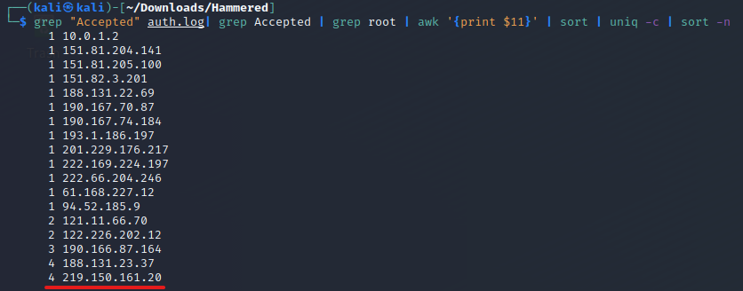
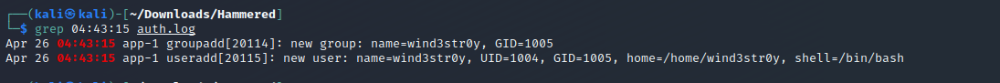
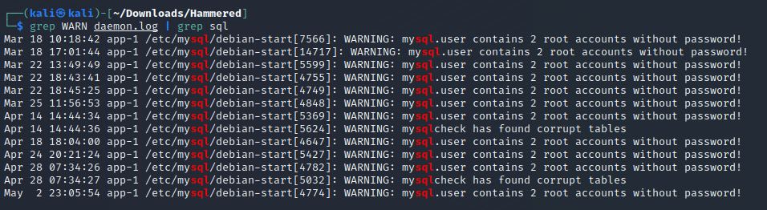
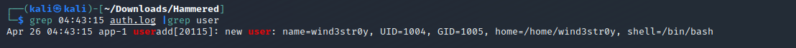

<h1 align="center"> Hammered CTF Walkthrough </h1>

<h3 align="center">


</h3>

<p>
This challenge takes you into the world of virtual systems and confusing log data. In this challenge, figure out what happened to this webserver honeypot using the logs from a possibly compromised server.

The following skills that are gained/utilized in this challenge are: `Log Analysis` `WebServer` `Honeypot` `Apache2`
</p>
<br></br>

<h1> First Impressions </h1>
<p>
Before we take any further actions on the challenges or do any investigations, we need to realize the initial scope of the CTF. Looking at the challenge instructions, we are given a zip file and a list of files to focus our analysis on:

    File Name: c26-Hammered.zip
    File Size: 944 KB
    SHA1SUM: c5282824e485cbafe4b13a942759fd6720433929

Make sure you verify the **SHA1SUM** hash value of any files you download by doing the following (this will verify the integrity of the downloaded file):


Below are all files that are present after extracting the zip archive:


**Files in Scope**:
- kern.log
- auth.log
- daemon.log
- dmesg
- apache2


</p>
<br></br>

<h1> Challenge Questions </h1>

### Q1. Which service did the attackers use to gain access to the system?
<p>

First we can check and verify what log file is needed for this problem which can be found in [this article](https://www.eurovps.com/blog/important-linux-log-files-you-must-be-monitoring/). You can conclude that the `auth.log` file is of interest, so we can look with this command:

```bash
grep "fail" auth.log | less
```

```log
pam_unix(sshd:auth): authentication failure; logname= uid=0 euid=0 tty=ssh ruser= rhost=8.12.45.242  user=root
pam_unix(sshd:auth): authentication failure; logname= uid=0 euid=0 tty=ssh ruser= rhost=8.12.45.242  user=root
pam_unix(sshd:auth): authentication failure; logname= uid=0 euid=0 tty=ssh ruser= rhost=8.12.45.242  user=root
pam_unix(sshd:auth): authentication failure; logname= uid=0 euid=0 tty=ssh ruser= rhost=8.12.45.242  user=root
```

From this output we can see that there are many attempts to login via `sshd`.

**Answer** ✅: SSH
</p>
<br></br>

### Q2. What is the operating system version of the targeted system?
<p>
For this question you can actually find the awnser to this 2 deferent ways:

You look into the `kern.log` file, as it contains information logged by the kernel. Try this:

```bash
head kern.log
```

```
kernel: Inspecting /boot/System.map-2.6.24-26-server
kernel: Loaded 28787 symbols from /boot/System.map-2.6.24-26-server.
kernel: Symbols match kernel version 2.6.24.
kernel: Loaded 14773 symbols from 62 modules.
kernel: [    0.000000] Initializing cgroup subsys cpuset
kernel: [    0.000000] Initializing cgroup subsys cpu
kernel: [    0.000000] Linux version 2.6.24-26-server (buildd@crested) (gcc version 4.2.4 (Ubuntu 4.2.4-1ubuntu3)) #1 SMP Tue Dec 1 18:26:43 UTC 2009 (Ubuntu 2.6.24-26.64-server)
```

You also look into the `dmesg` file, as it contains information contains Kernel ring buffer messages, device status, hardware errors and other generic messages. Try this:

```bash
head dmesg
```
```
[    0.000000] Initializing cgroup subsys cpuset
[    0.000000] Initializing cgroup subsys cpu
[    0.000000] Linux version 2.6.24-26-server (buildd@crested) (gcc version 4.2.4 (Ubuntu 4.2.4-1ubuntu3)) #1 SMP Tue Dec 1 18:26:43 UTC 2009 (Ubuntu 2.6.24-26.64-server)
[    0.000000] Command line: root=UUID=a691743a-a4b7-482d-95ff-406e5acd83a3 ro quiet splash
[    0.000000] BIOS-provided physical RAM map:
[    0.000000]  BIOS-e820: 0000000000000000 - 000000000009f800 (usable)
[    0.000000]  BIOS-e820: 000000000009f800 - 00000000000a0000 (reserved)
[    0.000000]  BIOS-e820: 00000000000ca000 - 00000000000cc000 (reserved)
[    0.000000]  BIOS-e820: 00000000000dc000 - 00000000000e4000 (reserved)
[    0.000000]  BIOS-e820: 00000000000e8000 - 0000000000100000 (reserved)
```

**Answer** ✅: 4.2.4-1ubuntu3
</p>
<br></br>

### Q3. What is the name of the compromised account?
<p>

From our previous investigation in the first question, we can see that most of the attempts were done via the `root` user account.

**Answer** ✅: root
</p>
<br></br>

### Q4. Consider that each unique IP represents a different attacker. How many attackers were able to get access to the system?
<p>

For this question, I actually got the question right with a guess... (I used the following command and got 17 unique IPs back, excluding the one local IP):

```bash
grep sshd auth.log| grep "Accepted password" | awk '{print $11}'  | sort | uniq -c | sort -n
```
```
1 10.0.1.2
1 151.81.204.141
1 151.81.205.100
1 151.82.3.201
1 188.131.22.69
1 190.167.70.87
1 190.167.74.184
1 193.1.186.197
1 201.229.176.217
1 222.169.224.197
1 222.66.204.246
1 61.168.227.12
1 94.52.185.9
2 121.11.66.70
2 122.226.202.12
3 190.166.87.164
4 188.131.23.37
4 219.150.161.20
```

**Answer** ✅: 6
</p>
<br></br>

### Q5. Which attacker's IP address successfully logged into the system the most number of times?
<p>

We can count them with a command like this: 
```bash
grep "Accepted" auth.log| grep Accepted | grep root | awk '{print $11}' | sort | uniq -c | sort -n
```


**Answer** ✅: 219.150.161.20
</p>
<br></br>

### Q6. How many requests were sent to the Apache Server?
<p>

For this question, we can reference [this article](https://developer.mozilla.org/en-US/docs/Web/HTTP/Methods) which shows that HTTP defines a set of request methods to indicate the desired action to be performed for a given resource. This type of information will appear on the Apache server in the `www-access.log` file:

```bash
grep "HTTP" www-access.log | wc -l
```

**Answer** ✅: 365
</p>
<br></br>

### Q7. How many rules have been added to the firewall?
<p>

This question is asking you to find all rules that have been ALLOWED on the server via the firewall. You can find more about firewalls on linux (or in this case UFW) [here](https://www.linux.com/training-tutorials/introduction-uncomplicated-firewall-ufw/). I did this with a simple grep comment to find all activity that has to do with ALLOW:

```bash 
grep ufw* auth.log| grep allow | awk '{print $NF}' | sort -u | uniq -c
```

```
1 113
1 113/identd
1 113/Identd
1 22
1 2685/tcp
1 2685/telnet
1 53
1 telnet
```

You can see that there are duplicates in the output but we can conclude that there are 6 entries.

**Answer** ✅: 6
</p>
<br></br>

### Q8. One of the downloaded files to the target system is a scanning tool. Provide the tool name.
<p>

**Answer** ✅: NMAP

</p>
<br></br>

### Q9. When was the last login from the attacker with IP 219.150.161.20? Format: MM/DD/YYYY HH:MM:SS AM
<p>

For this question, we can simpily just grep the timestamp to get the FULL time and date:

```bash
grep 04:43:15 auth.log
```



**Answer** ✅: 04/19/2010 05:56:05 AM
</p>
<br></br>

### Q10. The database displayed two warning messages, provide the most important and dangerous one.
<p>

We will be checking the `daemon.log` file. This is because database will run as a service so its information will store in here:

```bash
grep WARN daemon.log | grep sql
```



**Answer** ✅: mysql.user contains 2 root accounts without password!
</p>
<br></br>

### Q11. Multiple accounts were created on the target system. Which one was created on Apr 26 04:43:15?
<p>

For this question, we can simpily use a previous grep the timestamp to get the user that was associated with the account creation:

```bash
grep 04:43:15 auth.log | grep user
```



**Answer** ✅: wind3str0y 
</p>
<br></br>

### Q12. Few attackers were using a proxy to run their scans. What is the corresponding user-agent used by this proxy?
<p>

We can check the `www-access.log` file for this information as it pertains to User-Agent info on the webserver. We can grep to filter this:

```bash
cat www-access.log | cut -d ' ' -f 12 | sort | uniq
```
```
"Apple-PubSub/65.12.1"
"Mozilla/4.0
"Mozilla/5.0
"pxyscand/2.1"
"WordPress/2.9.2;
```

**Answer** ✅: pxyscand/2.1
</p>
<br></br>